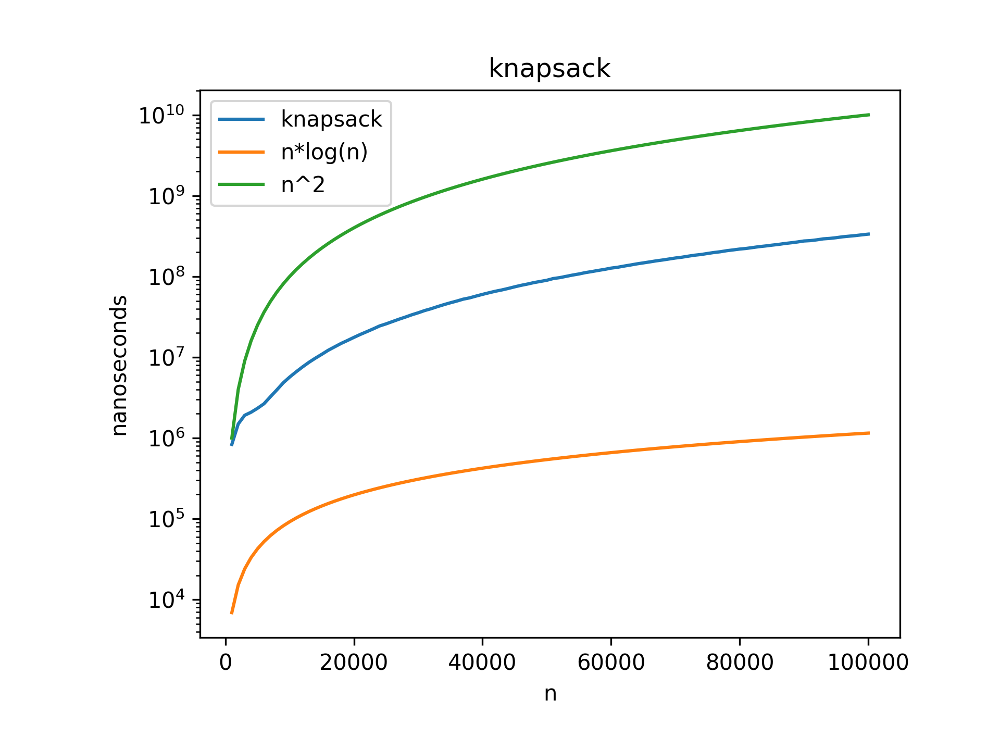

# Analysis and Design of Algorithms
> Collection of all programs for ADA lab 2025

## Index
- [x] Quicksort
    - Time Complexity - O(nlogn)
    - Space Complexity - O(n)
    - sorting of an array using a pivot ensuring the elements to the left of the pivot are smaller than the pivot and elements right of pivot are larger than it
    - The pivot is put in the position where it it should be when the whole array is sorted
    - Uses a recursive structure to sort each side split along the index of the pivot
    
- [x] Iterative Quicksort
    - Time Complexity - O(nlogn)
    - Space Complexity - O(logn)
    - Similar to recursive quicksort but uses a stack to maintain the index of the places where the pivot cut the array
    - Quicksort in iterative form
    - Reduces the size of stack used
    
- [x] Comparing stack size of iterative vs recursive quicksort
    
- [x] Peak - Peak finding algorights for 1D and 2D arrays
    - Time Complexity - O(logn)
    - Space Complexity - O(1)
    - Finding an element which is larger to all its neighbours
    - [x] 1D 
        - Implemented using algo similar to Binary Search
    
    - [x] 2D
        - Implemented using algo similar to Binary Search but works in a 2D array
    
- [x] Magic square(odd size) - Sum of all rows, columns and diagonals is equals
    - Time Complexity - O(n2)
    - Space Complexity - O(n2)
    - Creates a square matrix where the sum of all colums, rows and diagonals is equal
    - Follows a set pattern in where the numbers increase in a diagonal fashion upwards to the left and goes down one when number is a multiple of the n
    
- [x] Cosine Similarity
    - Time Complexity - O(n+m)
    - Space Complexity - O(n+m)
    - Find out the similarity between two documents by checking the number of time each word occours in each file
    - Each files words are treated like a vector and the angle between the vectors created from the two file give the value for cosQ which tells us the similarity between the files
- [x] Fractional Knapsack
    - Time Complexity - O(nlogn)
    - Space Complexity - O(1)
    - Problem involving the calculation of max(here price) that can be gotten from a set of values
    - We sort the array according to the metric we need(here we sort 3 time, according to profit, weight and ratio of profit/weight) and then pick the items in non-increasing manner
    - The fractional part allows us to pick out items in fraction
        - For example if we have a capacity of 10 and the item weights 20 we can take out 10 out the weight instead of leaving that item and going to the next
    
- [x] Job Scheduling
    - Time Complexity - O(nlogn)
    - Space Complexity - O(1)
    - Schedule all jobs for the day ensuring maximum number of jobs are done
    - FCFS, SJF and sorting by final_time used
    
    - Time complexity of SJF is very high due to checking of availibility of that job
    
- [x] Matrix multiplication
    - [x] Conventional Method
        - Time Complexity - O(n3)
        - Space Complexity - O(n2)
        - Using divide and conquer to break the matrix into smaller parts
        - When we end up with a 2x2 matrix we compute the result and send it back with then further computes that result
        - Using smaller solves matrixs we get the larger C result matrix
    - [x] Strassen's matrix multiplication
        - Time Complexity - O(n3)
        - Space Complexity - O(n2)
        - turn the O(n3) algo into a O(n2.81) algorithm
        - Gives 7 equations to cut the matrix so that we have to compute 1 less matrix per loop thus saving time
    
- [x] Polygon Hull
    - [x] QuickHull
        - Time Complexity - O(nlogn)
        - Space Complexity - O(n)
        - [x] Using aproch similar to quicksort we divide the problem into multiple triangles and seperately solve them
        - We first take the min and max elements on the X-axis and divide the points into 2 parts
        - On each part we call a reccursive algorithm which finds a point which makes the largest area of a triangle with the previously gotten points
        - Now on the remaining 2 sides of the triangle we recursivly call this algorithm till we have no points outside the triangle with the maximum area
        - Each points found during the recursive calls and the min and max points on X-axis make our polygon hull
        
- [x] Dijkastra
    - Time Complexity - O(n2)
    - Space Complexity - O(n)
    - Find the shortest path from source to sink
    - Follows a greedy approach to travel the edge with the minimum cost from the current node
    - We only visit every node once and once we have visited a node its value is set permanently
- [x] Kruskals
    - Time Complexity - O(ElogE)
    - Space Complexity - O(E+V)
    - Minimum spanning tree
    - Picks out a minimum edge and checks if there parents are the same
        - If we get same parents we don’t use that edge as it causes a loop
        - Otherwise we use that edge in our tree
- [x] Prims
    - Time Complexity - O(n2)
    - Space Complexity - O(n)
    - Finds one minimum edge using the merge sort technique and then find the shortest edge from the 2 selected vertex’s
    - keeps on adding the shortest edges that extend from our visited vertex’s that don’t go to our visited vertexs
    - Minimum spanning tree\
    
    
- [x] All Pair Shortest Path(Floyd-Warshall Algorithm)
    - Time Complexity - O(n3)
    - Space Complexity - O(n2)
    - We find the minimum cost to go from any vertex to any other vertex
    - We store the intermidiate result in the original adjency matrix or create a new one
        - The values are updated if we find a new minimum cost
- [x] Multistage graph
    - A grpah that has a single starting node and a single ending node
    - Find out the cost to go to from source to sink from any node
    - We start from the source to sink from each posible way and store the distances in a result array
    - [x] Forward method
        - Time Complexity - O(n2)
        - Space Complexity - O(n)
        - Works like a DFS algorithm, where we go from source to sink in all possible ways. We complete the full path before going back and trying another path
        
    - [x] Backword method
        - Time Complexity - O(n3)
        - Space Complexity - O(n)
        - Similar to the Forward method but we go from sink to the source
        
- [x] Matrix Chain Multiplication
    - Time Complexity - O(n3)
    - Space Complexity - O(n2)
    - Find the order of multiplication to reduce the number of scalar multiplications
    - Calculate the minimum cost of matrix multiplication by reducing the number of scalar multiplication needed
    - Bundles together matrix multiplications using their sizes and shows the optimal order of multiplication
    - Creates a 2D array containing the cost to multiply any combination of the matrixes
- [x] Knapsack using sets(merge purge)
    - Time Complexity - O(n2)
    - Space Complexity - O(n)
    - Solved knapsack using sets and mergePurge technique
    - Dynamic Programming solution
- [x] Longest Common Subsequences
    - Time Complexity - O(mn)
    - Space Complexity - O(mn)
    - Find the longest subsequence of two strings
    - Starts from the ends of the strings and compares if there are any same elements in the other string
    - Creates a 2D array containing the path to create the subsequence
- [x] NQueens
    - Time Complexity - O(n!)
    - Space Complexity - O(n)
    - Place N Queens on a NxN board
    - Using a backtracking approach to start filling out from the starting square
    - Backtrack on the given condition that col != col and row != row and (abs(j - k) != abs(x[j] - i)) which makes sure that the queens can’t see each other
- [x] M Colorable graph
    - Time Complexity - O(Mn)
    - Space Complexity - O(n)
    - Find out the ways in which a graph can be colored using M colors without the adjecent nodes having the same color
    - Using a backtracking approach to try out all the colors on all nodes
    - Backtrack on the given condition that color appears on one of the neighbours of the node.
- [x] Hamiltonian Graph
    - Time Complexity - O(n!)
    - Space Complexity - O(n)
    - Finding a path in traverses all the vertexs without repeating them
    - We should end on the same vertex we started from
    - Using the backtracking approach we try to explore all the path and return when we can't find a vertex to traverse to other vertexs without repeating an old one
    - Gives out the correct order to traverse the graph to visit all the vertexs once
- [x] Sum of subsets
    - Time Complexity - O(n!)
    - Space Complexity - O(n)
    - Finding all the subsets of a set whose sum is equal to a given value
    - Assumes that we sort the starting array
    - Using backtracking we try out all posible combinations for the subsets and quit when we - 
        - Find that the remaining values are less than than what we require
        - Current value generated + new value will tip us over the required ammount
    - Gives out the elements that make up that valid tuple
